# 14-05-2026 — Rev 2.5 planning and buck converter design

This project serves as a rev 2.5 of the raspberry pi DAQ (data acquisition) hat. A few months ago, I tested and diagnosed a cause of catatrophic failure of the rev 2 DAQ hat using voltage injection and a thermal camera. Although rev 3 was planned, and I am still working on it, along with others, the current failed rev 2 PCBs are still being partially used for their features that still function. This aims to be a quick revision that consolidates some of the features, while being cheap to manufacture by relying on external subpar modules (although they are expected to function perfectly fine).

I first began by planning what I would include and not include in the revision. The buck converter was essential for taking 24V from the car power LV power line and converting it to 5V for the Raspberry Pi. Existing modules cut too many corners to be reliable for this use, especially at 3A peak current. However, rev 2 also included a boost converter to boost 20V PD to 24V for injecting PoE for the base station antenna, and for ease of powering during testing. Since the current here would be pretty low, I decided to use a MT3608 and PDC004 PD module (I already have one, and the design seems pretty good; really big power plane on bottom) on a separate PCB.

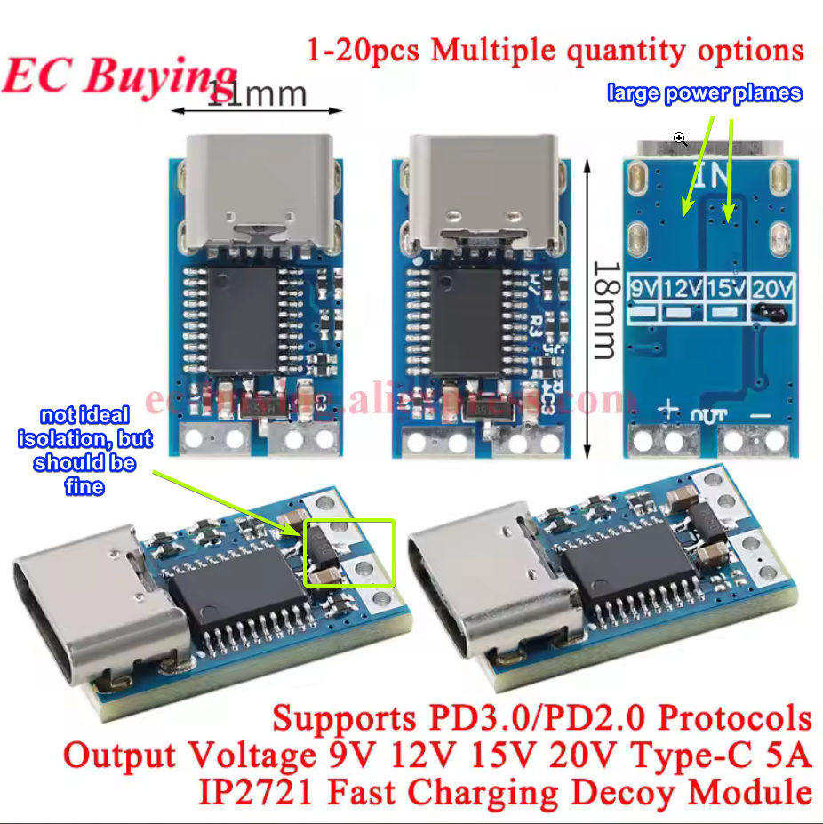

The MT3608 module also should be able to handle the current required (2A) for the 24V PoE injection, which should be around 1A peak. The IC itself is pretty capable, there often just isn't a great component selection or insufficient decoupling/filtering. I remebered [this greatscott video](https://www.youtube.com/watch?v=6bicunweBAQ) where he added a 2.2uF 1210 capacitor to the output of the MT3608 to improve stability, so I thought with that, it should be very sufficient for my application.

I began with designing the buck with TI WEBENCH power designer, which I had some experience using before. But first, I wanted to select a buck converter that was relatively cheap and had a low component count. I started with JLCPCB basic parts, and found the TPS5430, which seemed to fit all my requirements. After some part selection (finding available inductor and output tantalum cap on LCSC), I settled with a design/layout idea. I drafted some of the schematic together, but still a lot to work on.

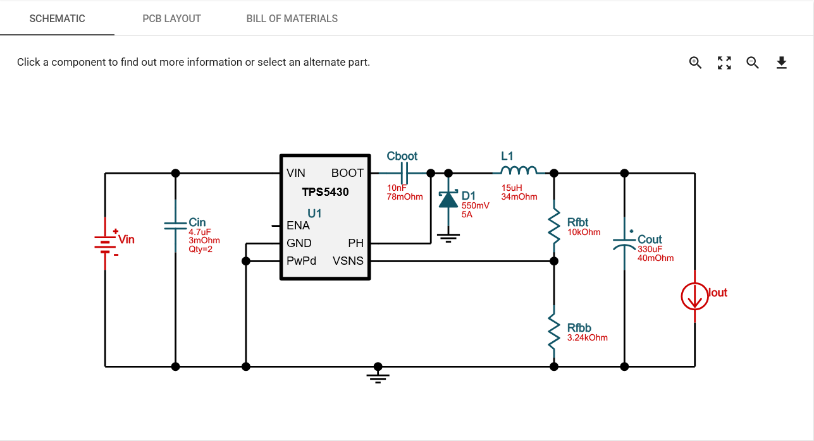

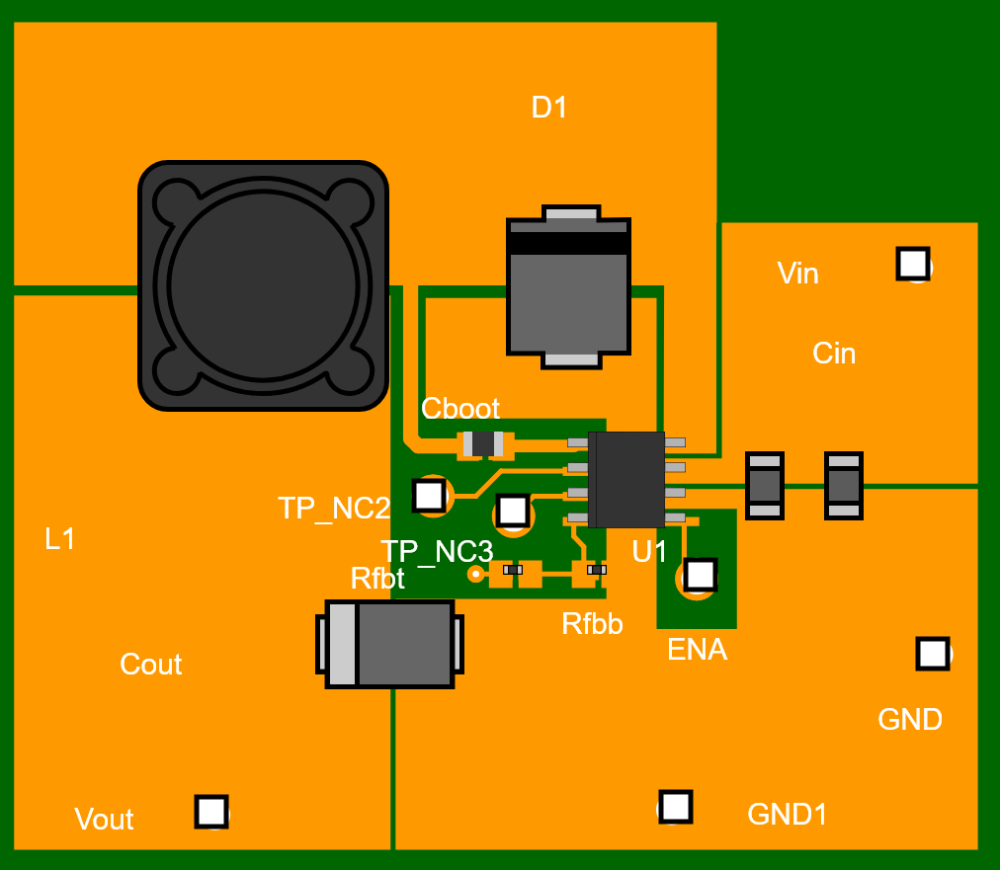

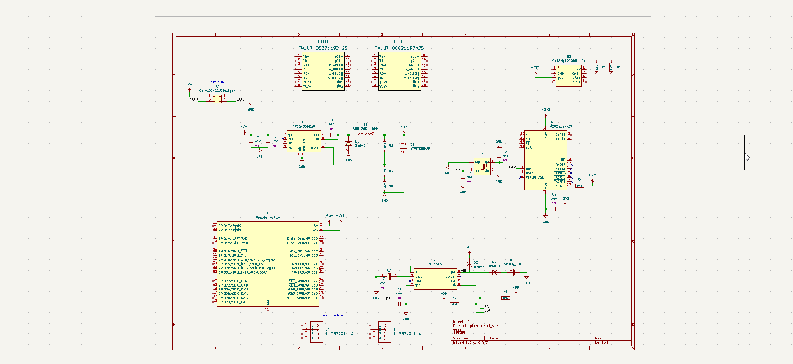

Total time spent: 4 hours

# 15-05-2026 — Input protection and schematic completion

I started by looking into input protection from the car on the 24V rail. I decided to use a polyfuse and TVS diode to protect the input from overvoltage/transients and overcurrent. I took some component selection inspiration from [this waveshare module](https://www.waveshare.com/wiki/2-CH_CAN_HAT+), which does the CAN and HV power input for powering the RPi. I also spent some time finishing up the rest of the schematic (importing components for terminal blocks + ethernet) and trying to keep things somewhat organized.

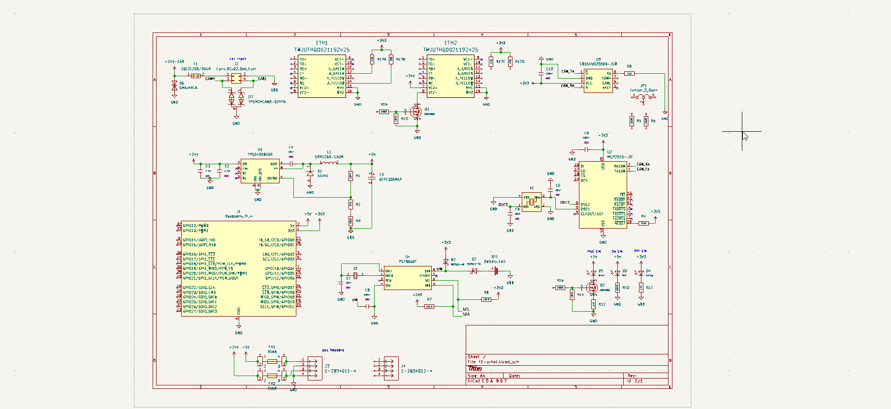

I also switched some of the power logic later on, to make sure 20V PD was OR'd to the buck and not 24V Boost, to reduce strain on the boost converter and to make sure there's less ripple on the 5V rail (since having 20V -> 24V -> 5V is less ripple than having 20V -> 5V). I eventually finished up the schematic (for now, still need to confirm with a few team members) and imported it to the PCB layout.

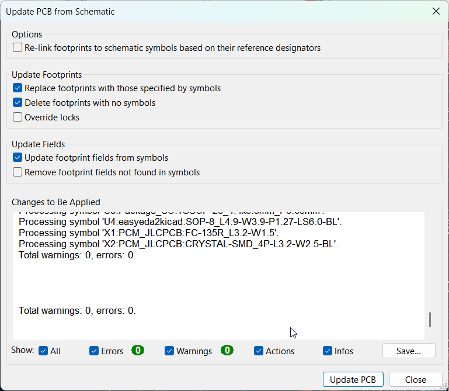

Routing sure is going to be fun.

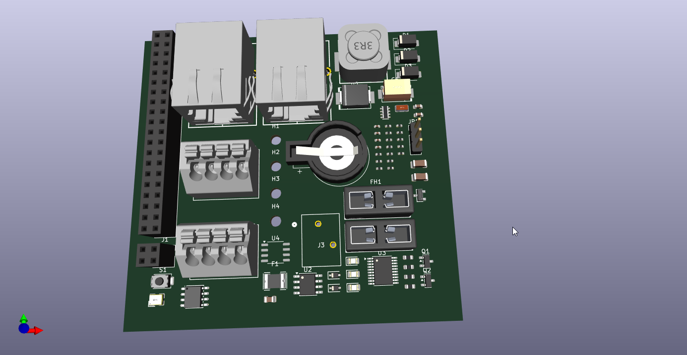

Total time spent: 3 hours

# 18-05-2026 — Buck converter PCB layout

I started the day by setting up the board and mounting holes based on the RPi mechanical drawings and trying to route the buck converter, as I knew I would need to route the rest of the board around it.

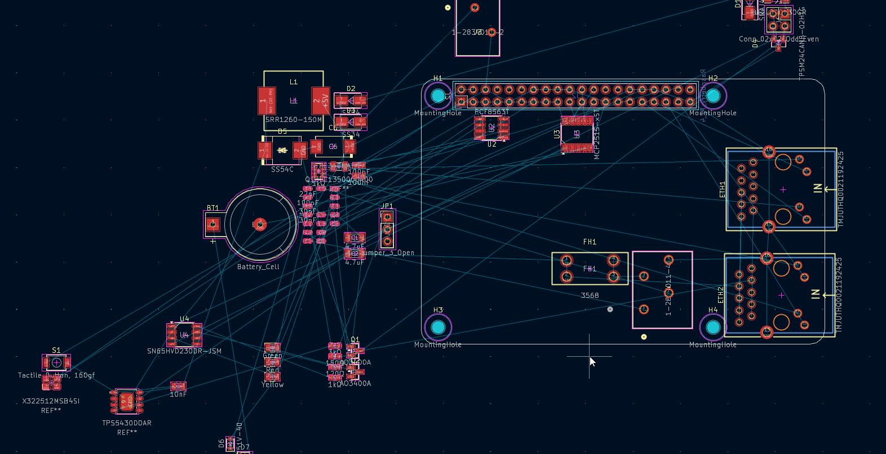

I also needed to route the ethernet and terminal blocks, which would be a pain. I had also never used filled polygons before for routing, so it took a while to get the hang of it after watching a few videos of laying out switching power supplies. One thing I quickly realized was that the provided recommended layout was not the best:

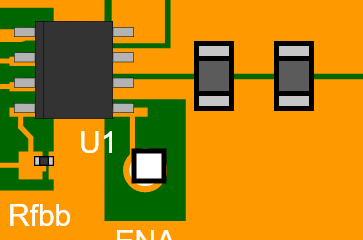
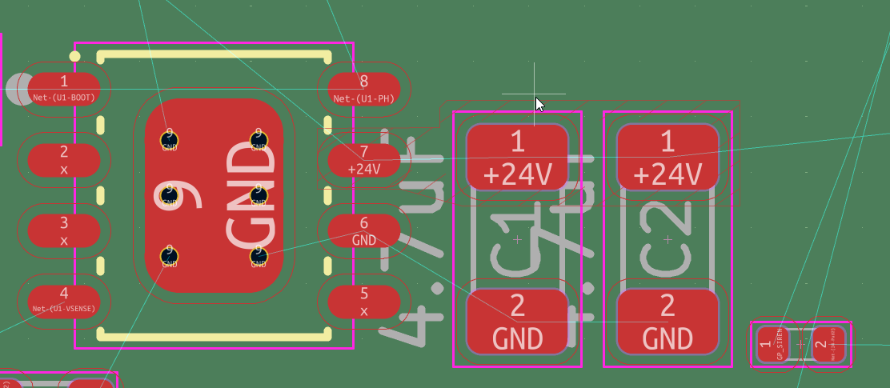

After some trial and error, and asking in the Slack for a review, I was able to get something pretty good.

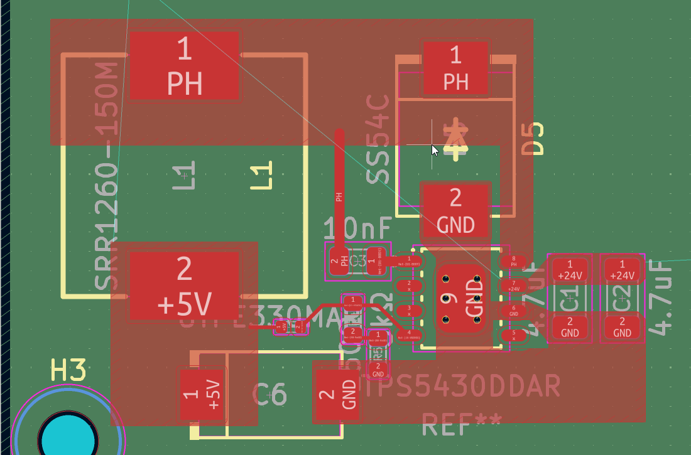
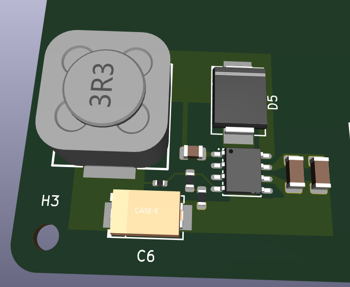

I had removed the 2nd auxillary terminal block earlier today as I thought it wasn't going to fit on the board, but looking at it again after laying some things out, it should be able to fit. I might add it back in later depending on how the routing goes.

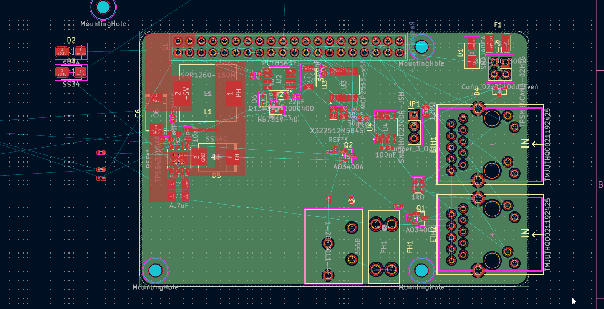

Total time spent: 4 hours

# 19-05-2026 — PoE switch, LEDs, and ethernet routing

My initial PoE switch was a low-side switch, since it was the easiest to implelement. Howeever after searching for a bit, I realized that a high-side switch would be better for this application due to external issues that could arise with floating ground. Since the PoE is 24V, a P-Ch MOSFET would be a bit difficult to implement as most have a max Vgs of +/-20V. I looked into high-side driver ICs and decided to roll with that instead. After some searching on LCSC, I found a good one from TI (TPS1H200A), which is made for automotive applications and is very flexible. It has a lot of builtin protection and diagnostic reporting, and is quite cheap ($0.75). And it can handle up to 2.5A with overcurrent protection.

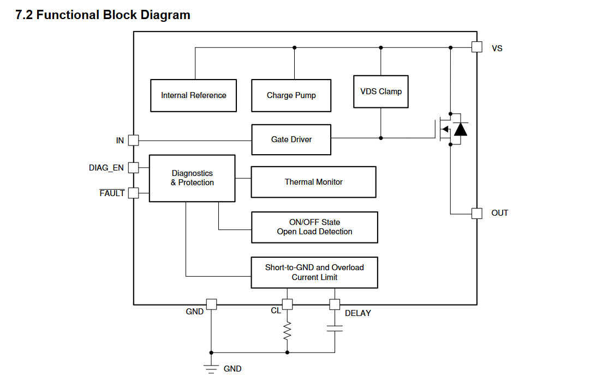

Another thing that annoyed me was the different brightness of LEDs on the status indicators of Rev 2, since all colour LEDs used the same resistors, so I tried to compensate for that by using a different resistance for each colour LED.

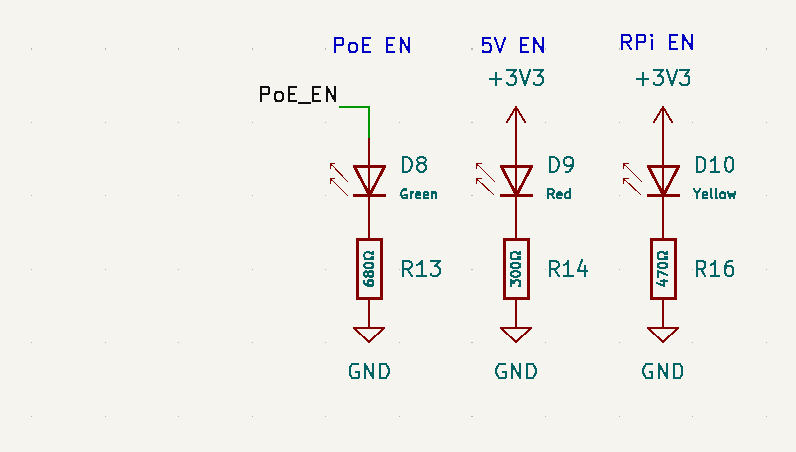

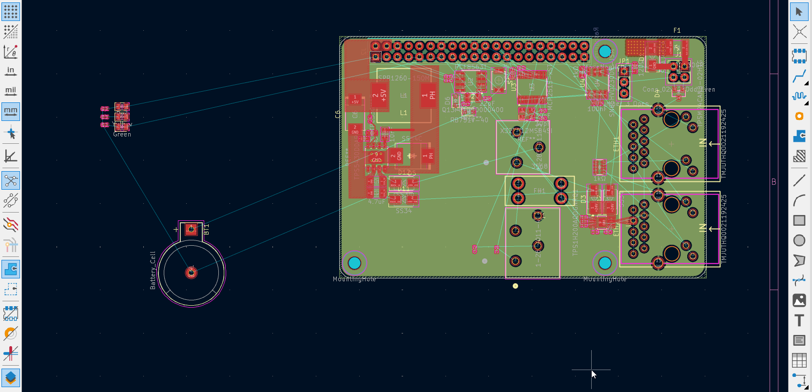

I also added the footprint for the coin cell battery holder I wanted to use, which I had to do manually since the TE component didn't have a footprint. After talking to another team member, I also switched the PD/Boost module header from a 3-pin terminal block to 3 pin headers to reduce the footprint; it would be connected with: holes - wires - Deutsch connectors - wires - usb c breakout.

Lastly, I decided to tackle the ethernet routing. The impedance matching wasn't too bad and got over that pretty easily, but I quickly realized the routing was not going to be wasy due to the layout.

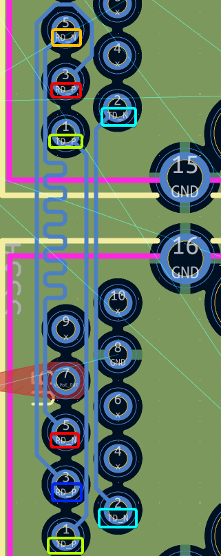

This was my first attempt, which very much wasn't ideal. I tried some more for a while and eventually asked for help in the Slack, but got no response. I asked a team member for help, and he sent me a rough example of how he would do it. I did mine based on that, and it turned out pretty good.

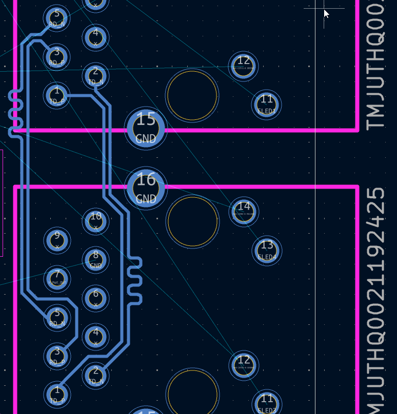

Total time spent: 5 hours

# 20-05-2026 — Boost/PD module and main PCB routing

I began with working on the external boost + PD module. I got the MT3608 module symbol + footprint online, but slightly modified to make sure it would fit variations of the board too. Just as a check, I also found a STEP model on GrabCAD and imported it to Kicad to make sure it would fit on the footprint. I had already made the PD module symbol and footprint on Altium, so I imported it to Kicad.

For the PCB, I made the PD module surface mount on the bottom and the MT3608 on the top, since both have large pads on both sides with vias.

I also decided to add back the auxillary terminal block, which was easy to place since I had every other component approximatly in place.

After spending about an hour cleaning up the schematic (it was quite difficult to fit everything in), I started the final stretch of routing the logic components and adding silkscreen labels.

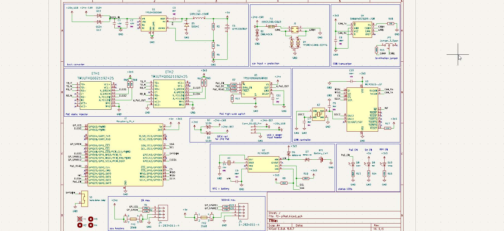

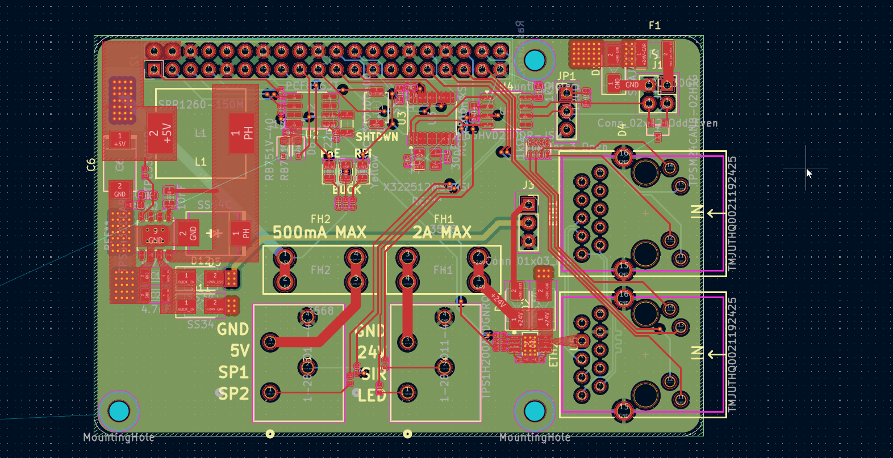

This is about what I have so far, just need to route grounds to the ground plane and route a few more minor things. I also realized that a 20mm dia cell would be too big because of the vias I added near the buck, which is where I planned to mount the cell (on the bottom). I decided to switch to a 12mm dia cell, and manually added the footprint for the TE mount (CR1225).

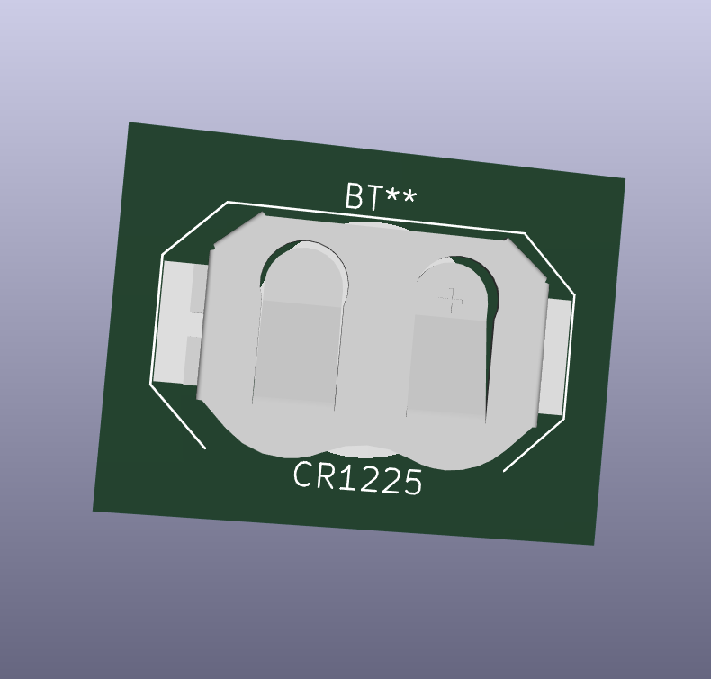

Total time spent: 5 hours

# 21-05-2026 — Final routing, review feedback, and production prep

I started off by finishing the routing and uploading the pcb files to github. I also asked for a review in the Slack, but after not getting a response, I send the schematic and pcb for the subteam lead to review. He had concerns about power switching, since during testing it was important to preserve the car's battery as much as possible. He suggested I add a jumper to select between 24V Car rail and the 24V Boost+20V PD rail. However, since this would require a DPDT switch in my current configuration (it would be possible if the boost converter was just on the board, which is the case for rev 3), I decided to just add a jumper to the input of the 24V Car rail, so it could be disabled without unplugging the Deutsch connector.

I also selected some high current jumpers with a grip section on Digikey. Moreover, I got asked to select a strobe light and buzzer for the base station, which woud be used only in testing. Since they weren't too important in terms of performance or importance, I selected some cheap ones from AliExpress.

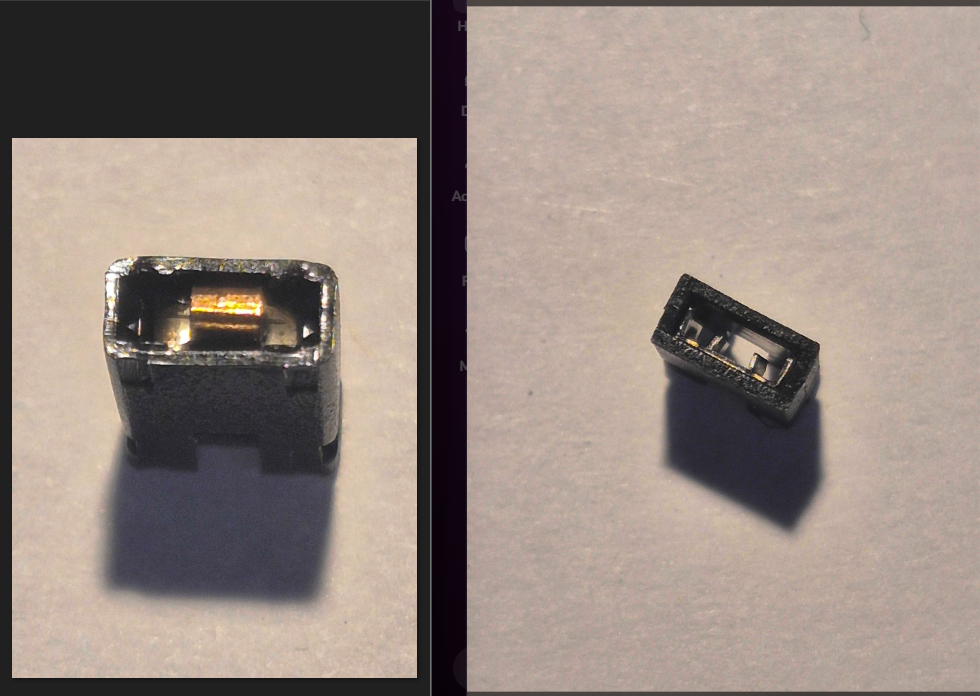

High vs low current rated jumpers.

Lastly, I spent some time polishing some routing, adding prod files and confirming they upload to JLCPCB, and creating a README.

Total time spent: 4 hours
