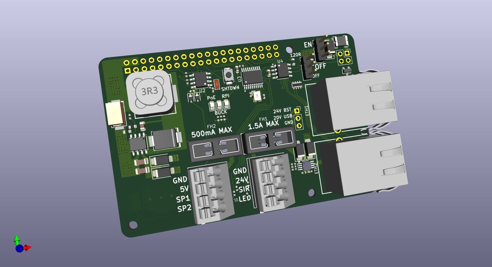
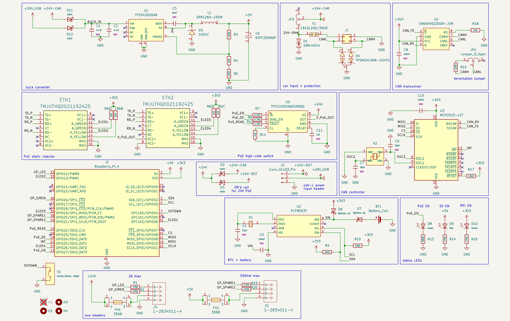
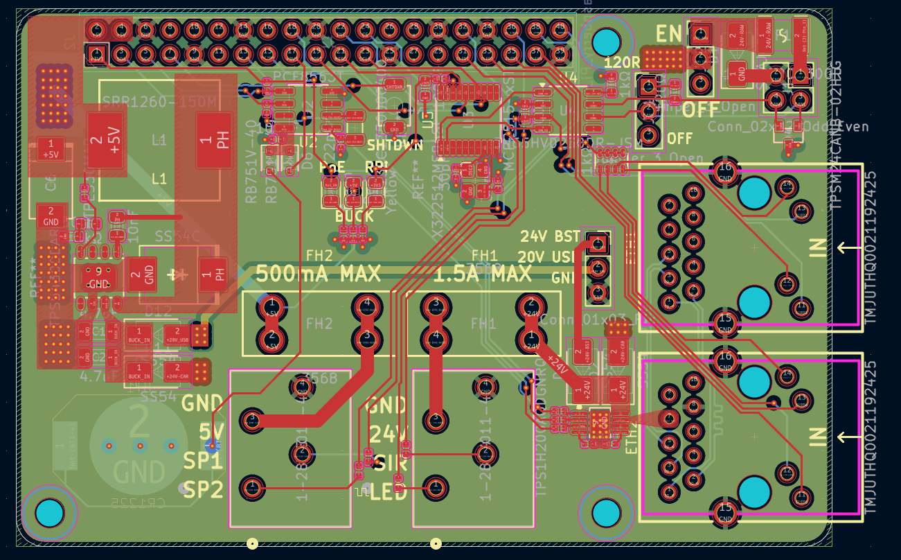
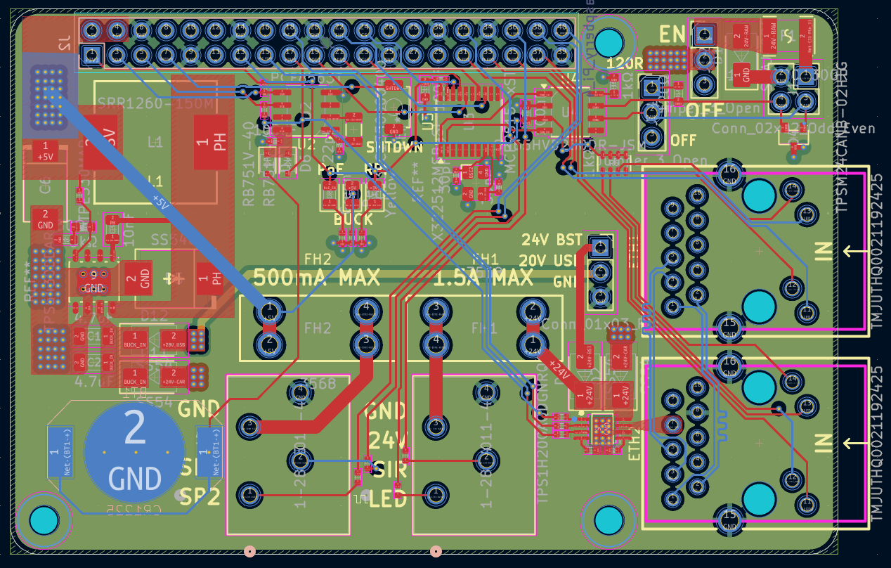
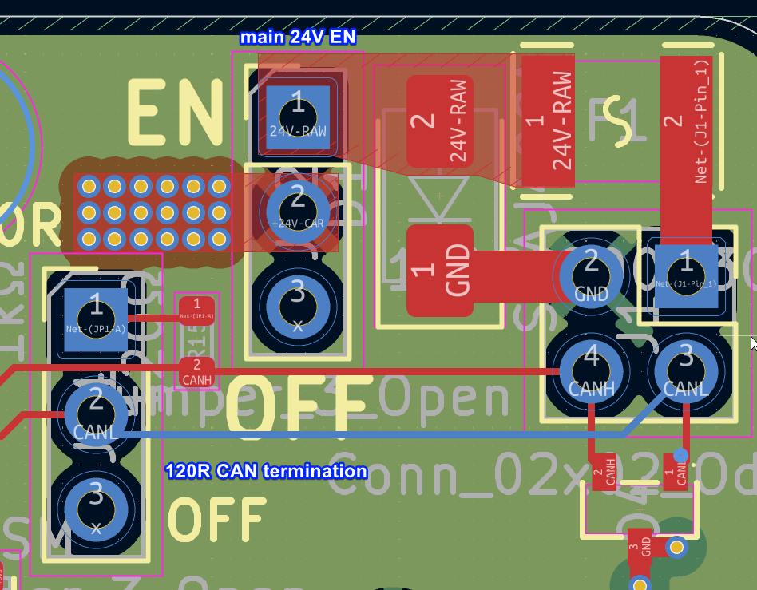

# FSAE Pi HAT
## What this project is

This project is a revision 2.5 of the Raspberry Pi DAQ (data acquisition) HAT for FSAE. It consolidates the features still needed from the failed rev 2 boards into a single HAT: a 24 V → 5 V buck converter to power the Pi, input protection on the car rail, CAN transceiver + controller, static PoE injection control, and RTC with coin cell for the Pi 4B.

## Why I made it

A few months ago, I tested and diagnosed a cause of catastrophic failure of the rev 2 DAQ HAT using voltage injection and a thermal camera. Although rev 3 was planned, and I am still working on it, along with others, the current failed rev 2 PCBs are still being partially used for their features that still function. This aims to be a quick revision that consolidates some of the features, while being cheap to manufacture.

The buck converter is one of the essential parts of the hat. Existing modules cut too many corners to be reliable, especially at 3A peak current. Currently, the buck coverter on the Rev 2 board is blown up. 

Rev 2 also included a boost converter to boost 20V USB-C PD to 24 V for injecting PoE for the base station antenna, and for ease of powering during testing. Since this is at a lower current, I decided to use a modified MT3608 boost converter and a PDC004 USB-C PD trigger on a separate PCB for ease of design and cost.

## Pictures

### 3D



### Schematic



**[View schematic online (KiCanvas)](https://kicanvas.org/?repo=https%3A%2F%2Fgithub.com%2Fpicafe%2Ffsae-daq-hat%2Fblob%2Fmain%2Ffsae-pihat%2Ffsae-pihat.kicad_sch)**

### PCB (KiCad)




**[View PCB online (KiCanvas)](https://kicanvas.org/?repo=https%3A%2F%2Fgithub.com%2Fpicafe%2Ffsae-daq-hat%2Fblob%2Fmain%2Ffsae-pihat%2Ffsae-pihat.kicad_pcb)**

### Wiring (off-board)

The 20 V USB-C PD → 24 V boost path is **not** on this HAT. It is implemented on the companion [USB boost/PD module](./fsae-pihat-usbmod/README.md), wired to the **J3** pads on the HAT.

```text
HAT J3 pads (no header installed)
    │  wire
    ▼
Deutsch connector
    │  wire
    ▼
USB-C PD breakout (MT3608 + PDC004)
```
The 2 main power devices source power from different sources using power OR-ing with schottky barrier diodes. 

The buck converter is powered by 24V from the car rail or the 20V USB-C PD (to reduce strain on the boost converter and to keep less ripple on the 5 V rail).
The PoE injector is powered by 24V from the car rail or the 24v boost converter.

A jumper on the **24 V car** input (JP2) can disable the car rail without unplugging the Deutsch connector, to preserve the car battery during bench testing. This MUST be populated to enable the car rail with a high current 0.1" pitch jumper. There is also a CAN termination jumper (JP1) to enable or disable 120Ω termination on the CAN bus.



## USB boost / PD module

The MT3608 boost and PDC004 USB-C PD trigger are on a separate PCB. Schematics, layout, images, and BOM for that board are in **[fsae-pihat-usbmod/README.md](./fsae-pihat-usbmod/README.md)**.

## Bill of materials (Pi HAT)


### JLCPCB SMT assembly

| Refs | Qty | Description | LCSC | Unit (USD) | Min | Ext. @ min (USD) |
| --- | ---: | --- | --- | ---: | ---: | ---: |
| C1, C2, C3 | 3 | 4.7 µF ±10% 50 V X7R ceramic, 1206 | [C29823](https://www.lcsc.com/product-detail/C29823.html) | $0.0426 | 10 | $0.43 |
| C10, C9 | 2 | 30 pF ±5% 50 V C0G ceramic, 0402 | [C1570](https://www.lcsc.com/product-detail/C1570.html) | $0.0013 | 100 | $0.13 |
| C11, C12 | 2 | 100 nF ±10% 50 V X7R ceramic, 0603 | [C14663](https://www.lcsc.com/product-detail/C14663.html) | $0.0031 | 100 | $0.31 |
| C4 | 1 | 10 nF ±10% 50 V X7R ceramic, 0805 | [C1710](https://www.lcsc.com/product-detail/C1710.html) | $0.0072 | 50 | $0.36 |
| C5 | 1 | 22 pF ±5% 50 V C0G ceramic, 0402 | [C1555](https://www.lcsc.com/product-detail/C1555.html) | $0.0014 | 100 | $0.14 |
| C6 | 1 | 330 µF ±20% 6.3 V tantalum, 7.3×4.3 mm SMD (6TPE330MAP) | [C79112](https://www.lcsc.com/product-detail/C79112.html) | $0.6851 | 1 | $0.69 |
| C7 | 1 | 100 nF ±10% 50 V X7R ceramic, 0402 | [C307331](https://www.lcsc.com/product-detail/C307331.html) | $0.0047 | 100 | $0.47 |
| C8 | 1 | 1 µF ±10% 25 V X5R ceramic, 0402 | [C52923](https://www.lcsc.com/product-detail/C52923.html) | $0.0040 | 100 | $0.40 |
| D1, D2, D4, D5 | 4 | 40 V 5 A Schottky, SMA (SS54) | [C7420369](https://www.lcsc.com/product-detail/C7420369.html) | $0.0448 | 10 | $0.45 |
| D10 | 1 | Emerald green 525 nm LED, 2.6–3.1 V, 0805 | [C2297](https://www.lcsc.com/product-detail/C2297.html) | $0.0163 | 50 | $0.82 |
| D11 | 1 | Red 630 nm LED, 1.6–2.6 V, 0805 | [C84256](https://www.lcsc.com/product-detail/C84256.html) | $0.0133 | 50 | $0.67 |
| D12 | 1 | Yellow 596 nm LED, 1.8–2.4 V, 0805 | [C2296](https://www.lcsc.com/product-detail/C2296.html) | $0.0122 | 50 | $0.61 |
| D3 | 1 | 40 V 5 A Schottky, SMC (SS54C) | [C18199188](https://www.lcsc.com/product-detail/C18199188.html) | $0.0737 | 10 | $0.74 |
| D6 | 1 | 64.5 V clamp TVS, 6.2 A Ipp, DO-214AC/SMA (SMAJ40CA) | — | — | — | — |
| D7, D9 | 2 | 40 V 30 mA Schottky, SOD-323 (RB751V-40) | [C7502691](https://www.lcsc.com/product-detail/C7502691.html) | $0.0149 | 50 | $0.75 |
| D8 | 1 | 50 V CAN TVS clamp, 5.5 A Ipp, SOT-23 (TPSM24CANB-02HTG) | [C970029](https://www.lcsc.com/product-detail/C970029.html) | $0.0495 | 10 | $0.50 |
| F1 | 1 | Polymeric PTC resettable fuse, 30 V 2 A, 1812 (1812L200/30GR) | [C18198342](https://www.lcsc.com/product-detail/C18198342.html) | $0.0812 | 5 | $0.41 |
| L1 | 1 | 15 µH ±20% shielded inductor, 5 A, 12.5×12.5 mm (SRR1260-150M) | [C2041333](https://www.lcsc.com/product-detail/C2041333.html) | $1.3721 | 1 | $1.37 |
| R1 | 1 | 1 kΩ ±5% resistor network, 0603×4 | [C20197](https://www.lcsc.com/product-detail/C20197.html) | $0.0059 | 50 | $0.30 |
| R10, R11, R12 | 3 | 4.7 kΩ ±1% thick-film, 0402 | [C25900](https://www.lcsc.com/product-detail/C25900.html) | $0.0010 | 100 | $0.10 |
| R13, R14, R19, R4 | 4 | 10 kΩ ±1% thick-film, 0402 | [C25744](https://www.lcsc.com/product-detail/C25744.html) | $0.0013 | 100 | $0.13 |
| R15 | 1 | 680 Ω ±1% thick-film, 0402 | [C25130](https://www.lcsc.com/product-detail/C25130.html) | $0.0011 | 100 | $0.11 |
| R16, R18, R2, R3, R7, R8 | 6 | 470 Ω ±1% thick-film, 0402 | [C25117](https://www.lcsc.com/product-detail/C25117.html) | $0.0008 | 100 | $0.08 |
| R17 | 1 | 120 Ω ±1% thick-film, 0603 (CAN termination) | [C22787](https://www.lcsc.com/product-detail/C22787.html) | $0.0014 | 100 | $0.14 |
| R20 | 1 | 1 kΩ ±1% thick-film, 0603 | [C21190](https://www.lcsc.com/product-detail/C21190.html) | $0.0016 | 100 | $0.16 |
| R5 | 1 | 3 kΩ ±1% thick-film, 0603 | [C4211](https://www.lcsc.com/product-detail/C4211.html) | $0.0014 | 100 | $0.14 |
| R6 | 1 | 150 Ω ±1% thick-film, 0603 | [C22808](https://www.lcsc.com/product-detail/C22808.html) | $0.0018 | 100 | $0.18 |
| R9 | 1 | 1 kΩ ±1% thick-film, 0402 | [C11702](https://www.lcsc.com/product-detail/C11702.html) | $0.0011 | 100 | $0.11 |
| S1 | 1 | Tactile switch SPST, 160 gf, 4×3 mm SMD (TS-1088) | [C720477](https://www.lcsc.com/product-detail/C720477.html) | $0.0538 | 10 | $0.54 |
| U1 | 1 | TPS5430 buck regulator, 3 A, 5.5–36 V in, SOIC-8-EP | [C9864](https://www.lcsc.com/product-detail/C9864.html) | $0.7486 | 1 | $0.75 |
| U2 | 1 | TPS1H200A 2.5 A high-side switch (PoE injector), EMSOP-8-EP | [C2653785](https://www.lcsc.com/product-detail/C2653785.html) | $0.7476 | 1 | $0.75 |
| U3 | 1 | PCF8563T I²C real-time clock, SO-8 | [C7440](https://www.lcsc.com/product-detail/C7440.html) | $0.5834 | 1 | $0.58 |
| U4 | 1 | SN65HVD230 3.3 V CAN transceiver, 5 Mbps, SOP-8 | [C46596299](https://www.lcsc.com/product-detail/C46596299.html) | $0.4853 | 1 | $0.49 |
| U5 | 1 | MCP2515 1 Mbps CAN controller, TSSOP-20 | — | — | — | — |
| X1 | 1 | 32.768 kHz crystal ±20 ppm, 12.5 pF, SMD3215-2P | [C32346](https://www.lcsc.com/product-detail/C32346.html) | $0.1804 | 5 | $0.90 |
| X2 | 1 | 12 MHz crystal ±10 ppm, 20 pF, SMD3225-4P | [C9002](https://www.lcsc.com/product-detail/C9002.html) | $0.0744 | 10 | $0.74 |
| | | **LCSC subtotal @ MOQ** | | | | **$15.45 + 2 unlinked line items** |


### DigiKey (hand assembly)

| Refs | Qty | Description | DigiKey | Unit (CAD) | Ext. (CAD) |
| --- | ---: | --- | --- | ---: | ---: |
| J2 | 1 | 2×20 extended female GPIO header | [1568-16763-ND](https://www.digikey.ca/en/products/detail/sparkfun-electronics/16763/12686348) | $4.70 | $4.70 |
| J4, J5 | 2 | 4-pos 3.5 mm top-entry terminal block | [A123850-ND](https://www.digikey.ca/en/products/detail/te-connectivity-amp-connectors/1-2834011-4/5872966) | $1.57 | $3.14 |
| ETH1, ETH2 | 2 | RJ45 magjack 10/100 + PoE (Taoglas) | [931-TMJUTHQ0021192425-ND](https://www.digikey.ca/en/products/detail/taoglas-limited/TMJUTHQ0021192425/21777733) | $9.04 | $18.08 |
| FH1, FH2 | 2 | Blade fuse holder 30 A 500 V PCB | [36-3568-ND](https://www.digikey.ca/en/products/detail/keystone-electronics/3568/2137306) | $1.69 | $3.38 |
| BT1 | 1 | CR1225 coin-cell holder, 12 mm SMD | [BAT-HLD-012-SMTCT-ND](https://www.digikey.ca/en/products/detail/te-connectivity-linx/BAT-HLD-012-SMT-TR/5361776) | $0.75 | $0.75 |
| — | 1 | CR1225 3 V lithium cell (fits BT1) | *(Amazon, etc.)* | — | — |
| JP1, JP2 | 2 | 1×3 2.54 mm vertical pin header (solder to `JP1` / `JP2` footprints) | *(any 1×3 0.1″ 3A rated header)* | — | — |
| JP1 | 1 | CAN 120 Ω termination shunt | [S9341-ND](https://www.digikey.ca/en/products/detail/sullins-connector-solutions/NPC02SXON-RC/2618266) | $0.075 | $0.08 |
| JP2 | 1 | 24 V car-rail enable shunt | [S9341-ND](https://www.digikey.ca/en/products/detail/sullins-connector-solutions/NPC02SXON-RC/2618266) | $0.075 | $0.08 |
| | | **DigiKey subtotal (per board)** | | | **$30.20** |

**Not populated (DNP):**

| Refs | Footprint on PCB | Notes |
| --- | --- | --- |
| J1 | 2×2 pin socket | Do not install; car input harness wires solder to |
| J3 | 1×3 pin header | Do not install; boost/PD harness wires solder to |


