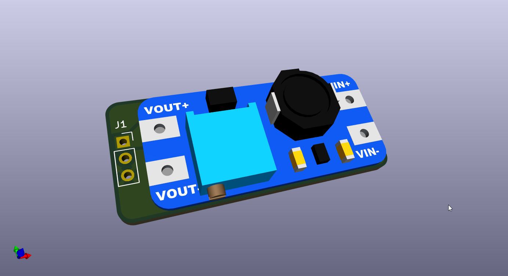
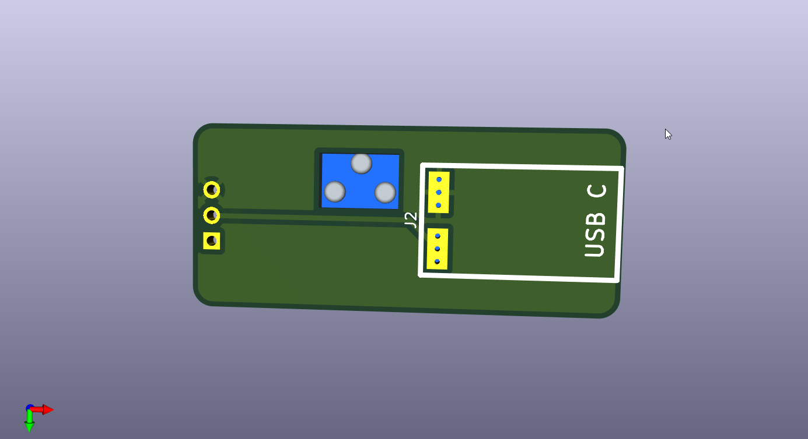
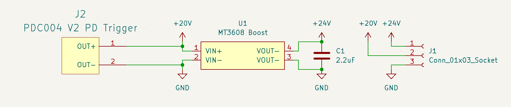
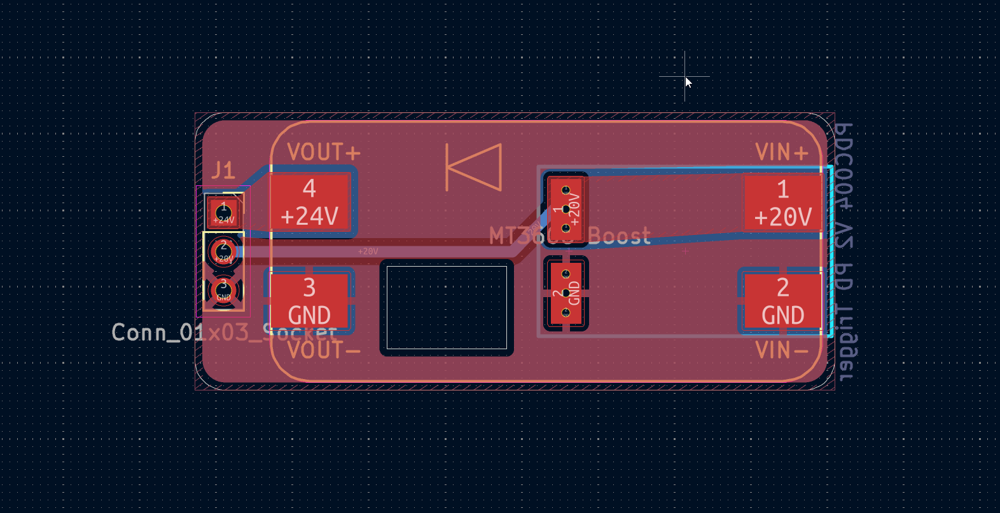
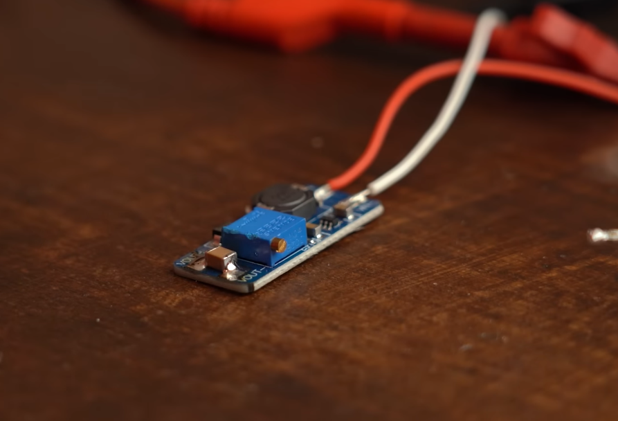

# FSAE Pi HAT — USB boost / PD module

## What this project is

This PCB is the external **20 V USB-C PD → 24 V boost** module used with the [main Pi HAT](../README.md). It pairs a **PDC004 V2** USB-C PD trigger (fixed 20 V) with an **MT3608** boost module to generate 24 V for PoE injection on the base station antenna and for convenient bench power during testing.

## Why I made it

Since the current here would be pretty low, I decided to use a MT3608 and PDC004 PD module (I already have one, and the design seems pretty good; really big power plane on bottom) on a separate PCB instead of putting a boost converter on the HAT.

The MT3608 module also should be able to handle the current required (2 A) for the 24 V PoE injection, which should be around 1 A peak. The IC itself is pretty capable; there often just is not a great component selection or insufficient decoupling/filtering. I remembered [this GreatScott video](https://www.youtube.com/watch?v=6bicunweBAQ) where he added a 2.2 µF 1210 capacitor to the output of the MT3608 to improve output ripple, so I added **C1 (2.2 µF)**.

## Pictures





### Schematic



**[View schematic online (KiCanvas)](https://kicanvas.org/?repo=https%3A%2F%2Fgithub.com%2Fpicafe%2Ffsae-daq-hat%2Fblob%2Fmain%2Ffsae-pihat-usbmod%2Ffsae-pihat-usbmod.kicad_sch)**

### PCB



**[View PCB online (KiCanvas)](https://kicanvas.org/?repo=https%3A%2F%2Fgithub.com%2Fpicafe%2Ffsae-daq-hat%2Fblob%2Fmain%2Ffsae-pihat-usbmod%2Ffsae-pihat-usbmod.kicad_pcb)**

### Wiring (off-board)

Connect to the main HAT **J3** and a USB-C PD supply:

```text
USB-C PD supply (20 V negotiated)
    │
    ▼
PDC004 module (J2, bottom of this PCB) ──► +20 V rail
    │
    ▼
MT3608 boost (U1, top of this PCB) ──► +24 V
    │
    ▼
3-pin header J1 ──► wires ──► Deutsch connectors ──► main HAT J3
```

For the PCB, the PD module is surface mount on the bottom and the MT3608 on the top, since both have large pads on both sides with vias.

## Bill of materials

| Designator | Footprint / package | Qty | Value | Notes |
| --- | --- | ---: | --- | --- |
| J1 | PinSocket_1x03_P2.54mm_Vertical | 1 | Conn_01x03_Socket | To main HAT |
| J2 | PDC004 Module | 1 | PDC004 PD Trigger | Fixed 20 V USB-C PD; AliExpress module |
| U1 | MT3608 Module | 1 | MT3608 Boost | AliExpress / generic boost module |
| C1 | C_1210 (hand solder on module) | 1 | [2.2 µF, 50V X7R 1210 CL32B225KBJNNNE](https://www.digikey.ca/en/products/detail/samsung-electro-mechanics/CL32B225KBJNNNE/3888542) | Output stability cap; solder on MT3608 output  |
